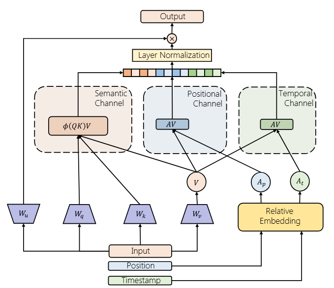

# FuXi-$\alpha$

This is the  Pytorch implementation for our paper `FuXi-𝛼: Scaling Recommendation Model with Feature Interaction Enhanced Transformer`

## Paper Overview

FuXi-𝛼 is a novel recommendation model that leverages an Adaptive Multi-channel Self-attention mechanism to distinctly model temporal, positional, and semantic features, along with a Multi-stage Feed-Forward Network to enhance implicit feature interactions. This model addresses the limitations of previous sequential recommendation models that inadequately integrate temporal and positional information. Our experiments demonstrate that FuXi-𝛼 outperforms existing models and its performance continues to improve as the model size increases.



## Getting started

### Public experiments

To replicate the public experiments conducted in the traditional sequential recommender setting on MovieLens as described in the paper, please follow these steps:

#### Install dependencies.

Install PyTorch based on official instructions. Then,

```
pip3 install gin-config absl-py scikit-learn scipy matplotlib numpy apex hypothesis pandas fbgemm_gpu iopath
```

#### Download and preprocess data.

```
mkdir -p tmp/ && python3 preprocess_public_data.py
```

#### Run model training.

A GPU with 24GB or more HBM should work for most datasets.

```
CUDA_VISIBLE_DEVICES=0 python3 main.py --gin_config_file=configs/ml-1m/fuxi-sampled-softmax-n128-final.gin --master_port=12345
```

Other configurations are included in configs/ml-1m, configs/ml-20m to make reproducing these experiments easier.

#### Verify results.

By default we write experimental logs to exps/. We can launch tensorboard with something like the following:

```
tensorboard --logdir ~/generative-recommenders/exps/ml-1m-l200/ --port 24001 --bind_all
tensorboard --logdir ~/generative-recommenders/exps/ml-20m-l200/ --port 24001 --bind_all
```

## Citation

If you find FuXi-$\alpha$ useful, please cite it as:

```
@article{ye2025fuxi,
  title={FuXi-$$\backslash$alpha $: Scaling Recommendation Model with Feature Interaction Enhanced Transformer},
  author={Ye, Yufei and Guo, Wei and Chin, Jin Yao and Wang, Hao and Zhu, Hong and Lin, Xi and Ye, Yuyang and Liu, Yong and Tang, Ruiming and Lian, Defu and others},
  journal={arXiv preprint arXiv:2502.03036},
  year={2025}
}
```

> Thanks to the excellent code repository [HSTU](https://github.com/facebookresearch/generative-recommenders)，which has saved us a lot of work in implementing the code.
