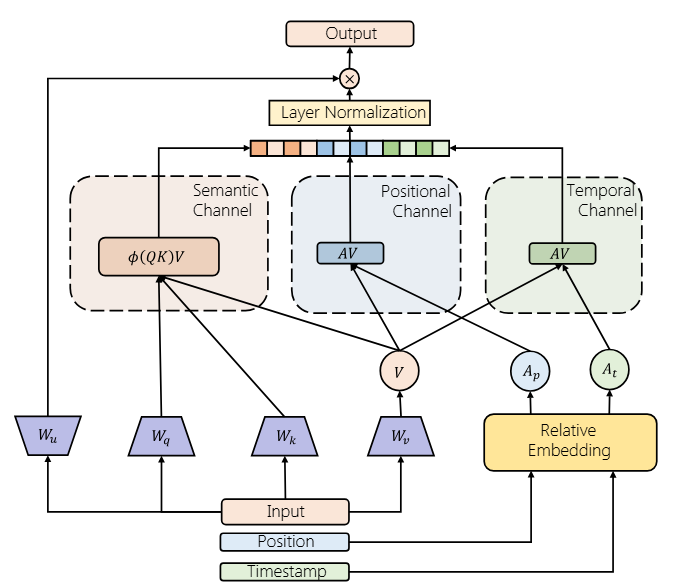
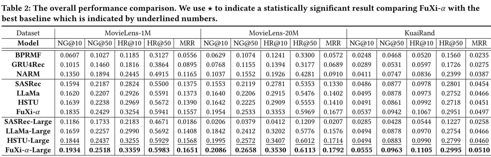
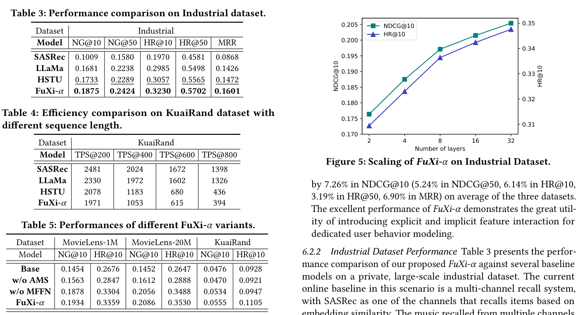

# FuXi-alpha

Official PyTorch implementation for **FuXi-alpha: Scaling Recommendation Model with Feature Interaction Enhanced Transformer**.

[](https://arxiv.org/abs/2502.03036)
[](https://doi.org/10.1145/3701716.3715448)
[](https://ustc-starteam.github.io/FuXi-alpha/)

## 1. Paper

Yufei Ye, Wei Guo, Jin Yao Chin, Hao Wang, Hong Zhu, Xi Lin, Yuyang Ye, Yong Liu, Ruiming Tang, Defu Lian, and Enhong Chen. **FuXi-alpha: Scaling Recommendation Model with Feature Interaction Enhanced Transformer**. In *Companion Proceedings of the ACM Web Conference 2025 (WWW Companion 2025)*, pages 557-566, Sydney, NSW, Australia, 2025.

[Paper](https://doi.org/10.1145/3701716.3715448) / [arXiv](https://arxiv.org/abs/2502.03036) / [PDF](https://arxiv.org/pdf/2502.03036) / [Project Page](https://ustc-starteam.github.io/FuXi-alpha/) / [Citation](#12-citation)

FuXi-alpha scales sequential recommendation with a feature-interaction enhanced Transformer. It models temporal, positional, and semantic signals through adaptive multi-channel self-attention and strengthens implicit feature interactions with a multi-stage feed-forward design.

## 2. Highlights

- Models temporal, positional, and semantic interactions in a unified sequential recommender.
- Uses a feature-interaction enhanced Transformer block for large-scale generative recommendation.
- Includes public MovieLens experiment configs for `ml-1m` and `ml-20m`.
- Builds on the HSTU/generative-recommenders codebase while adding the FuXi-alpha sequential encoder.

## 3. Method At A Glance



FuXi-alpha adds adaptive channels for multiple interaction views and a multi-stage FFN for implicit feature interaction, improving the scaling behavior of generative recommendation models.

## 4. Repository Structure

```text
.
├── configs/                                  # MovieLens experiment configs
├── generative_recommenders/modeling/         # Model components
├── generative_recommenders/trainer/          # Training pipeline
├── main.py                                   # Distributed training entry
├── preprocess_public_data.py                 # MovieLens preprocessing
├── requirements.txt
└── docs/                                     # GitHub Pages project page
```

The FuXi-alpha model code is under `generative_recommenders/modeling/sequential/fuxi.py`.

## 5. Installation

Install PyTorch following the official instructions for your CUDA environment, then install the project dependencies:

```bash
pip install -r requirements.txt
```

For a minimal manual setup, the original README used:

```bash
pip3 install gin-config absl-py scikit-learn scipy matplotlib numpy apex hypothesis pandas fbgemm_gpu iopath
```

## 6. Data

Prepare the public MovieLens data used in the paper experiments:

```bash
mkdir -p tmp/
python3 preprocess_public_data.py
```

## 7. Quick Start

Run FuXi-alpha on MovieLens-1M:

```bash
CUDA_VISIBLE_DEVICES=0 python3 main.py \
  --gin_config_file=configs/ml-1m/fuxi-sampled-softmax-n128-final.gin \
  --master_port=12345
```

Other configurations are available under `configs/ml-1m/` and `configs/ml-20m/`.

## 8. Reproducing Results

A GPU with 24GB or more HBM should work for most public MovieLens settings. Training logs are written to `exps/` by default.

Launch TensorBoard for inspection:

```bash
tensorboard --logdir ~/generative-recommenders/exps/ml-1m-l200/ --port 24001 --bind_all
tensorboard --logdir ~/generative-recommenders/exps/ml-20m-l200/ --port 24001 --bind_all
```

## 9. Configuration Notes

- `configs/ml-1m/fuxi-sampled-softmax-n128-final.gin`: default MovieLens-1M FuXi-alpha setting.
- `configs/ml-20m/fuxi-sampled-softmax-n128-final.gin`: default MovieLens-20M FuXi-alpha setting.
- Large configs are included for scaling comparisons with HSTU and SASRec baselines.

## 10. Experimental Highlights





These experiment crops show the public benchmark comparison, industrial result, efficiency table, ablation table, and scaling curve that motivate the concise summary below.


FuXi-alpha is designed for recommendation-model scaling rather than only small-model accuracy. The method separates interaction channels so temporal and positional signals are not collapsed into one representation path.

| Dataset | Base NDCG@10 / HR@10 | FuXi-alpha NDCG@10 / HR@10 | Readout |
| --- | --- | --- | --- |
| MovieLens-1M | 0.1454 / 0.2676 | 0.1934 / 0.3359 | Explicit and implicit feature interactions improve the public benchmark setting. |
| MovieLens-20M | 0.1452 / 0.2647 | 0.2086 / 0.3530 | The gain grows on the larger MovieLens dataset. |
| KuaiRand | 0.0476 / 0.0928 | 0.0555 / 0.1105 | The method also improves the industrial-style public dataset. |

The paper reports average gains over prior state of the art of **+7.26% NDCG@10**, **+5.24% NDCG@50**, **+6.14% HR@10**, **+3.19% HR@50**, and **+6.90% MRR** across the three public datasets.

**Conclusion:** FuXi-alpha shows that generative recommendation models can benefit from scale-aware channel design while remaining reproducible in the released pipeline.

## 11. Notes For Maintainers

- Keep FuXi-alpha implementation changes under `generative_recommenders/modeling/sequential/` unless the training pipeline itself needs to change.
- Preserve MovieLens config names because README commands and project-page examples depend on them.
- This repository reuses the excellent [HSTU / generative-recommenders](https://github.com/facebookresearch/generative-recommenders) codebase; keep attribution visible when reorganizing docs.

## 12. Citation

If you find FuXi-alpha useful, please cite:

```bibtex
@inproceedings{ye2025fuxialpha,
  title={FuXi-alpha: Scaling Recommendation Model with Feature Interaction Enhanced Transformer},
  author={Ye, Yufei and Guo, Wei and Chin, Jin Yao and Wang, Hao and Zhu, Hong and Lin, Xi and Ye, Yuyang and Liu, Yong and Tang, Ruiming and Lian, Defu and Chen, Enhong},
  booktitle={Companion Proceedings of the ACM Web Conference 2025},
  pages={557--566},
  year={2025},
  doi={10.1145/3701716.3715448}
}
```

## 13. Contact

- Co-first authors: Yufei Ye (`aboluo2003@mail.ustc.edu.cn`) and Wei Guo (`guowei67@huawei.com`).
- Corresponding authors: Hao Wang (`wanghao3@ustc.edu.cn`), Defu Lian (`liandefu@ustc.edu.cn`), and Enhong Chen (`cheneh@ustc.edu.cn`).
- Repository questions: please open a GitHub issue in this repository.
